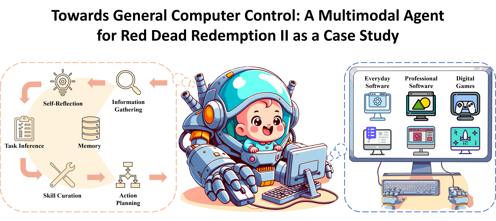

# Cradle: Empowering Foundation Agents towards General Computer Control
<div align="center">

[[Website]](https://baai-agents.github.io/Cradle/)
[[Arxiv]](https://arxiv.org/abs/2403.03186)
[[PDF]](https://arxiv.org/pdf/2403.03186.pdf)

[]()
[]()



The Cradle framework is a first attempt at General Computer Control (GCC). Cradle supports agents to ace any computer task by enabling strong reasoning abilities, self-improvment, and skill curation, in a standardized general environment with minimal requirements.

  </br>
 

## Videos

<a alt="Watch the video" href="https://www.youtube.com/watch?v=Cx-D708BedY"></a>
&nbsp;&nbsp;
<a alt="Watch the video" href="https://www.youtube.com/watch?v=Oa4Ese8mMD0"></a>

Click on either of the video thumbnails above to watch them on YouTube.

</div>

# Notice

We are still working on further cleaning up the code and constantly updating it. We are also extending Cradle to more games and software. Feel free to reach out!


# Installation

## Prepare the Environment File
When using OpenAI's provider to expose embeddings and LLM, it is essential to protect sensitive information such as API keys by defining them in environment variables.

The recommended approach is to create a `.env` file in the root of the repository (which should never be pushed to GitHub) to store these variables. 

Sample `.env` file containing private information:
```
OA_OPENAI_KEY = "abc123abc123abc123abc123abc123ab"
OA_CLAUDE_KEY = "abc123abc123abc123abc123abc123ab"
RF_CLAUDE_AK = "abc123abc123abc123abc123abc123ab"
RF_CLAUDE_SK = "123abc123abc123abc123abc123abc12"
IDE_NAME = "PyCharm"
```
OA_OPENAI_KEY is the OpenAI API key. You can get it from the [OpenAI](https://platform.openai.com/api-keys).

OA_CLAUDE_KEY is the Anthropic Claude API key. You can get it from the [Anthropic](https://console.anthropic.com/settings/keys).

RF_CLAUDE_AK and RF_CLAUDE_SK are the AWS Restful API key and secret key.

IDE_NAME refers to the IDE environment in which the repository's code runs, such as `PyCharm` or `Code` (VSCode). It is primarily used to enable automatic switching between the IDE and the game window.


## Setup Environment

### Python environment
Please setup your python environment and install the required dependencies as:

```bash
# Clone the repository
git clone https://github.com/BAAI-Agents/Cradle.git
cd Cradle

# Create a new conda environment
conda create --name uac-dev python=3.10
conda activate uac-dev
pip install -r requirements.txt

# Install the OCR tools
pip install https://github.com/explosion/spacy-models/releases/download/en_core_web_lg-3.7.1/en_core_web_lg-3.7.1.tar.gz

# Install faiss (CPU-only version)
conda install -c pytorch faiss-cpu=1.7.4 mkl=2021 blas=1.0=mkl

# Install torch and torchvision
pip install --upgrade torch==2.1.1+cu118 -f https://download.pytorch.org/whl/torch_stable.html
pip install torchvision==0.16.1+cu118 -f https://download.pytorch.org/whl/torch_stable.html

# Install the pre-compiled GroundingDino with the project dependencies
# 1. Download the weights to the cache directory
cd cache
curl -L -C - -O https://github.com/IDEA-Research/GroundingDINO/releases/download/v0.1.0-alpha2/groundingdino_swinb_cogcoor.pth
cd ..
# 2. Download the bert-base-uncased model from Hugging Face
mkdir hf
huggingface-cli download bert-base-uncased config.json tokenizer.json vocab.txt tokenizer_config.json model.safetensors --cache-dir hf
# 3. Install the groundingdino
cd ..
git clone https://github.com/IDEA-Research/GroundingDINO.git
cd GroundingDINO
pip install -r requirements.txt
pip install .
cd Cradle
```
If you encounter any issues during the installation of GroundingDINO, please refer to the official website [GroundingDINO](https://github.com/IDEA-Research/GroundingDINO) or our provided [GroundingDino Installation Guide](docs/envs/groundingdino.md).

Download the videosubfinder from https://sourceforge.net/projects/videosubfinder/ and extract the files into the res/tool/subfinder folder. We have already created the folder for you and included a test.srt, which is a required dummy file that will not affect results.

The file structure should be like this:

```
├── res
  ├── tool
    ├── subfinder
      ├── VideoSubFinderWXW.exe
      ├── test.srt
      ├── ...
```

### Game Setup
Due to the vast differences between each game, we have provided the specific settings for each game individually below.

1. [Cities: Skylines](docs/envs/skylines.md)
2. [Dealer's Life 2](docs/envs/dealers.md)
3. [Red Dead Redemption 2](docs/envs/rdr2.md)
4. [Stardew Valley](docs/envs/stardew.md)

# Get Started

To simplify operations, the default LLM model we use is OpenAI's `GPT-4o`. Below are the run scripts for different games and tasks.

```bash
# Run the Cities: Skylines example
python runner.py --envConfig "./conf/env_config_skylines.json"

# Run the Dealer's Life 2 example
python runner.py --envConfig "./conf/env_config_dealers.json"

# Run the Red Dead Redemption 2 example
python runner.py --envConfig "./conf/env_config_rdr2_main_storyline.json"
python runner.py --envConfig "./conf/env_config_rdr2_open_ended_mission.json"

# Run the Stardew Valley example
python runner.py --envConfig "./conf/env_config_stardew_cultivation.json"
python runner.py --envConfig "./conf/env_config_stardew_farm_clearup.json"
python runner.py --envConfig "./conf/env_config_stardew_shopping.json"
```

# Citation
If you find our work useful, please consider citing us!
```
@article{weihao2024cradle,
  title     = {{Cradle: Empowering Foundation Agents towards General Computer Control}},
  author    = {Weihao Tan and Wentao Zhang and Xinrun Xu and Haochong Xia and Ziluo Ding and Boyu Li and Bohan Zhou and Junpeng Yue and Jiechuan Jiang and Yewen Li and Ruyi An and Molei Qin and Chuqiao Zong and Longtao Zheng and YuJie Wu and Xiaoqiang Chai and Yifei Bi and Tianbao Xie and Pengjie Gu and Xiyun Li and Ceyao Zhang and Long Tian and Chaojie Wang and Xinrun Wang and  Börje F. Karlsson and  Bo An and  Shuicheng YAN and  Zongqing Lu},
  journal   = {arXiv:2403.03186},
  month     = {March},
  year      = {2024},
  primaryClass={cs.AI}
}
```
