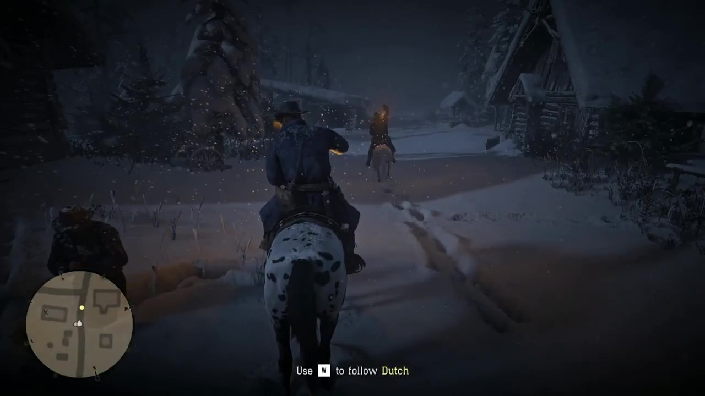

# Cradle: Empowering Foundation Agents Towards General Computer Control

[[Website]](https://baai-agents.github.io/Cradle/)
[[Arxiv]]()
[[PDF]]()

The Cradle project is a first attempt at General Computer Control (GCC). Cradle supports agents to ace any computer task by enabling strong reasoning abilities, self-improvment, and skill curation, in a standardized general environment with minimal requirements.

The framework and all materials are in constant evolution and this repository will include all released versions, along with publications and any other relevant assets.

# Releases and Updates

## Notice

We are still working on further cleaning up the code and constantly updating it. We are also extending Cradle to more games and software. Feel free to reach out!

## Upcoming release (in development and under review)

The updated released version of the framework is coming. The latest codebase is currently available on its own branches for now and will be merged to /main soon.

If you're interested in the project, this is the version you should look into.

Please clone this repository and use the code in the branches below. You need **both** currently for the latest results!

Code:
- Games: https://github.com/BAAI-Agents/Cradle/blob/dev-games/
- Software: https://github.com/BAAI-Agents/Cradle/blob/dev-software/

 

<!--    
   
 -->

## Latest Videos

&nbsp;&nbsp;

&nbsp;&nbsp;

&nbsp;&nbsp;

&nbsp;&nbsp;

&nbsp;&nbsp;

Click on either of the video thumbnails above to watch them on YouTube.

## Preliminary release

The preliminary version of the framework targetting RDR2 initially is being superseeded by the general code mentioned above. If you want to use the preliminary version, use the release tag to get the correct code and follow the original instructions in its own [README](docs/envs/gcc/README).

   
 

## Old Videos

&nbsp;&nbsp;

Click on either of the video thumbnails above to watch them on YouTube.

