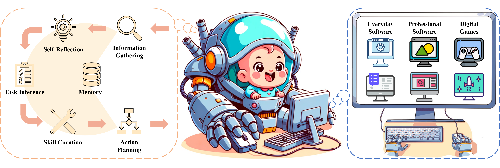

# Cradle: Empowering Foundation Agents Towards General Computer Control

<div align="center">

[[Website]](https://baai-agents.github.io/Cradle/)
[[arXiv (wait for update)]]()
[[PDF]](https://drive.google.com/file/d/1j5AF8lw7zJNq9VnUXLM8OsMvWlUGQG88/view?usp=sharing)

[]()
[]()



</div>

The Cradle framework empowers nascent foundation models to perform complex computer tasks
via the same unified interface humans use, i.e., screenshots as input and keyboard & mouse operations as output.

## 📢 Updates
- 2024-06-27: A major update! Cradle is extened to four games: [RDR2](https://www.rockstargames.com/reddeadredemption2), [Stardew Valley](https://www.stardewvalley.net/), [Cities: Skylines](https://www.paradoxinteractive.com/games/cities-skylines/about), and [Dealer's Life 2](https://abyteentertainment.com/dealers-life-2/) and various software, including but not limited to Chrome, Outlook, Capcut, Meitu and Feishu. We also release our latest [paper](https://arxiv.org/pdf/2403.03186). Check it out!

<div align="center">


</div>

## Latest Videos
<div align="center">
<a alt="Watch the video" href="https://www.youtube.com/watch?v=fkkSJw1iJJ8"></a>
&nbsp;&nbsp;
<a alt="Watch the video" href="https://www.youtube.com/watch?v=ay5gBqzPcDE"></a>
&nbsp;&nbsp;
<a alt="Watch the video" href="https://www.youtube.com/watch?v=regULK_60_8"></a>
&nbsp;&nbsp;
<a alt="Watch the video" href="https://www.youtube.com/watch?v=Kaiz4yJieUk"></a>
&nbsp;&nbsp;
<a alt="Watch the video" href="https://www.youtube.com/watch?v=WZiL_0V880M"></a>
&nbsp;&nbsp;
<a alt="Watch the video" href="https://www.youtube.com/watch?v=k0K_GbmTthg"></a>
&nbsp;&nbsp;
</div>

Click on either of the video thumbnails above to watch them on YouTube.

# 💾 Installation

## Prepare the Environment File
We currently provide access to OpenAI's and Claude's API. Please create a `.env` file in the root of the repository to store the keys (one of them is enough).

Sample `.env` file containing private information:
```
OA_OPENAI_KEY = "abc123abc123abc123abc123abc123ab"
RF_CLAUDE_AK = "abc123abc123abc123abc123abc123ab" # Access Key for Claude
RF_CLAUDE_SK = "123abc123abc123abc123abc123abc12" # Secret Access Key for Claude
AZ_OPENAI_KEY = "123abc123abc123abc123abc123abc12"
AZ_BASE_URL = "https://abc123.openai.azure.com/"
RF_CLAUDE_AK = "abc123abc123abc123abc123abc123ab"
RF_CLAUDE_SK = "123abc123abc123abc123abc123abc12"
IDE_NAME = "Code"
```
OA_OPENAI_KEY is the OpenAI API key. You can get it from the [OpenAI](https://platform.openai.com/api-keys).

AZ_OPENAI_KEY is the Azure OpenAI API key. You can get it from the [Azure Portal](https://portal.azure.com/#view/HubsExtension/BrowseResource/resourceType/Microsoft.CognitiveServices%2Faccounts).

OA_CLAUDE_KEY is the Anthropic Claude API key. You can get it from the [Anthropic](https://console.anthropic.com/settings/keys).

RF_CLAUDE_AK and RF_CLAUDE_SK are AWS Restful API key and secret key for Claude API.

IDE_NAME refers to the IDE environment in which the repository's code runs, such as `PyCharm` or `Code` (VSCode). It is primarily used to enable automatic switching between the IDE and the target environment.


## Setup

### Python Environment
Please setup your python environment and install the required dependencies as:
```bash
# Clone the repository
git clone https://github.com/BAAI-Agents/Cradle.git
cd Cradle

# Create a new conda environment
conda create --name cradle-dev python=3.10
conda activate cradle-dev
pip install -r requirements.txt
```

### Install the OCR Tools
```
1. Option 1
# Download best-matching version of specific model for your spaCy installation
python -m spacy download en_core_web_lg

or

# pip install .tar.gz archive or .whl from path or URL
pip install https://github.com/explosion/spacy-models/releases/download/en_core_web_lg-3.7.1/en_core_web_lg-3.7.1.tar.gz

2. Option 2
# Copy this url https://github.com/explosion/spacy-models/releases/download/en_core_web_lg-3.7.1/en_core_web_lg-3.7.1.tar.gz
# Paste it in the browser and download the file to res/spacy/data
cd res/spacy/data
pip install en_core_web_lg-3.7.1.tar.gz
```

# 🚀 Get Started
Due to the vast differences between each game and software, we have provided the specific settings for each of them below.
1. [Red Dead Redemption 2](docs/envs/rdr2.md)
2. [Stardew Valley](docs/envs/stardew.md)
3. [Cities: Skylines](docs/envs/skylines.md)
4. [Dealer's Life 2](docs/envs/dealers.md)
5. [Software](docs/envs/software.md)

<div align="center">
 
</div>

# Citation
If you find our work useful, please consider citing us!
```
@article{weihao2024cradle,
  title     = {{Cradle: Empowering Foundation Agents towards General Computer Control}},
  author    = {Weihao Tan and Wentao Zhang and Xinrun Xu and Haochong Xia and Ziluo Ding and Boyu Li and Bohan Zhou and Junpeng Yue and Jiechuan Jiang and Yewen Li and Ruyi An and Molei Qin and Chuqiao Zong and Longtao Zheng and Yujie Wu and Xiaoqiang Chai and Yifei Bi and Tianbao Xie and Pengjie Gu and Xiyun Li and Ceyao Zhang and Long Tian and Chaojie Wang and Xinrun Wang and Börje F. Karlsson and Bo An and Shuicheng Yan and Zongqing Lu},
  journal   = {arXiv:2403.03186},
  month     = {March},
  year      = {2024},
  primaryClass={cs.AI}
}
```
