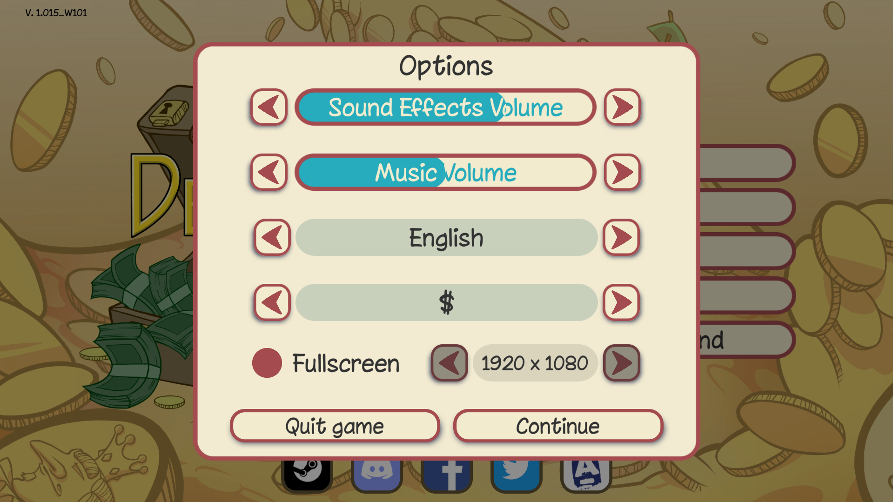

# Dealer's Life 2 

Here are the settings for Dealers' Life 2 game. And this environment is only available on Windows.

## Change Settings Before Running the Code
#### Display settings
- set your monitor resolution to 1920X1080.  
- Set the **Aspect Ratio** to 16:9
- Set the **Resolution** to 1920X1080
- Set the **Window Mode** to Fullscreen


## Running Cradle on Dealer's Life 2
1. Ensure that the game settings are set up as described above.
2. Launch the Dealer's Life 2 game.
3. Initialize a new game and set up the character.
4. Finish the tutorial and reach the main game screen.
5. Before further haggling with first customer, launch the framework agent with the command:
```bash
python runner.py --envConfig "./conf/envs/dealers.json"
```