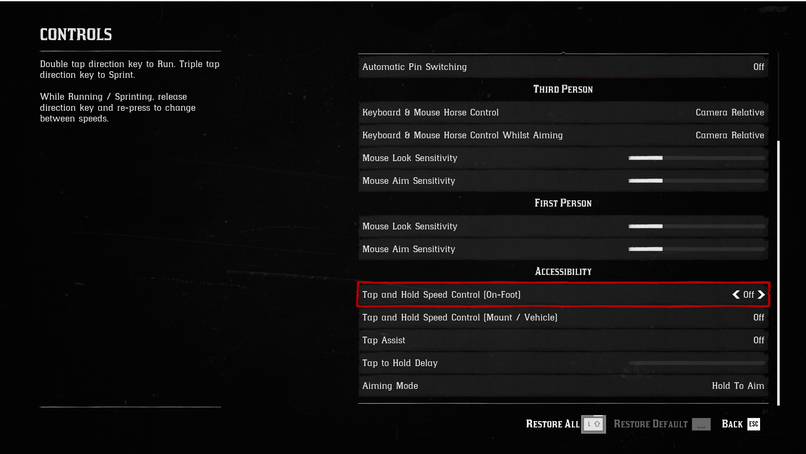
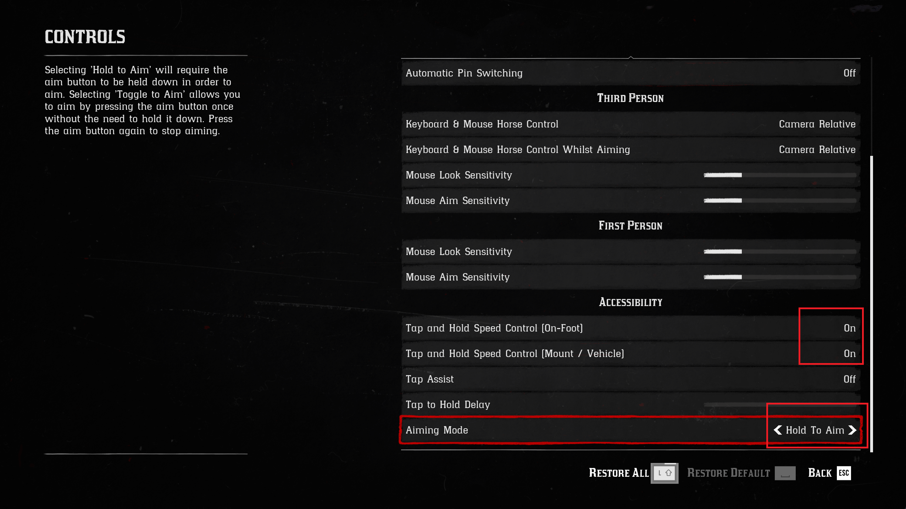
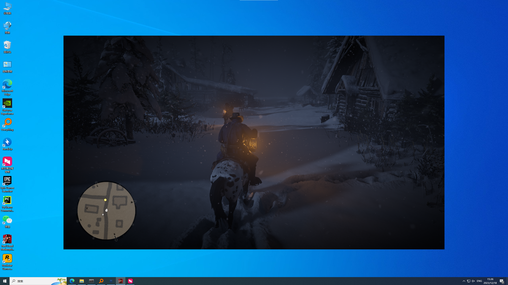
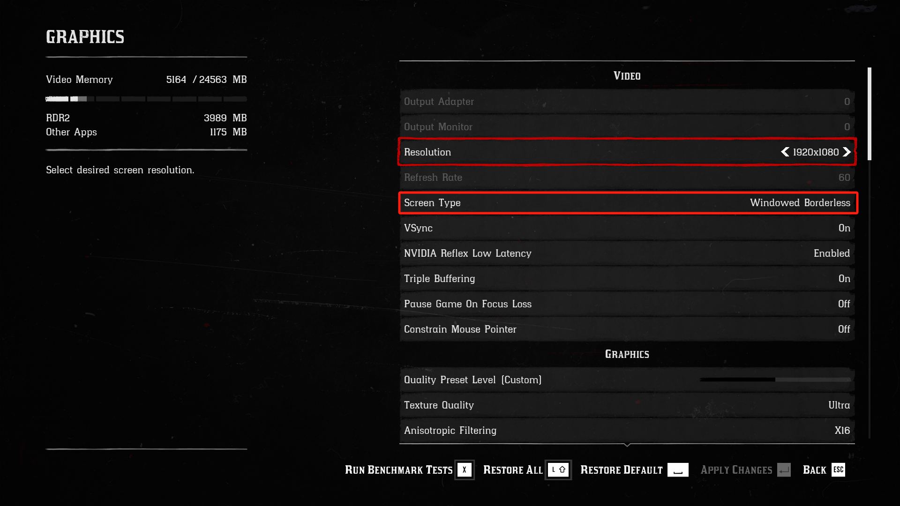
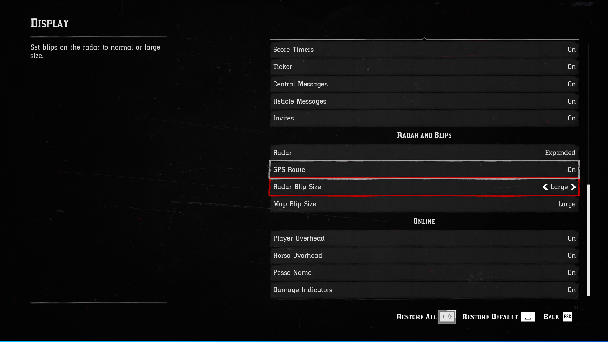
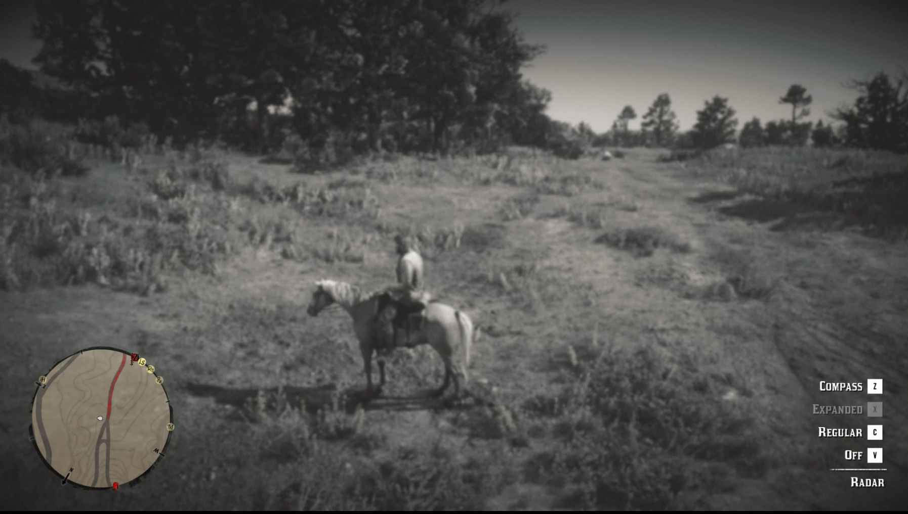
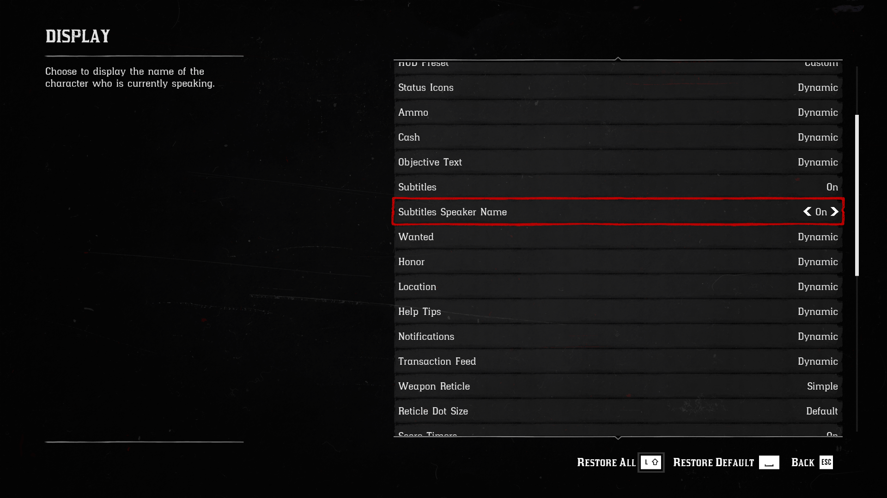

# Red Dead Redemption 2 (RDR2)

Here are the settings for Red Dead Redemption 2 (RDR2) game. And this environment is only available on Windows.

### Change Settings Before Running the Code

#### Mouse mode
Change mouse mode in the control setting to DirectInput.
| Original interface | Changed interface |
|------------|------------|
|  |  |

#### Control
Change both two 'Tap and Hold Speed Control' to on, so we can press w twice to run, saving the need to press shift. Also make sure 'Aiming Mode' to 'Hold To Aim', so we need to keep pressing the mouse right button when aiming.
| Original interface | Changed interface |
|------------|------------|
|  |  |

#### Game screen
The recommended default resolution to use is 1920x1080 (For developers, it must be 1920x1080), but it can vary if the **16:9** aspect ratio is preserved. This means your screen must be of size (1920,1080), (2560,1440) or (3840,2160). DO NOT change the aspect ratio. Also, remember to set the game Screen Type to **Windowed Borderless**.
`SETTING -> GRAPHICS -> Resolution = 1920X1080` and  `Screen Type = Windowed Borderless`

#### Mini-map
Remember to enlarge the icon to ensure the program is working well following: `SETTING -> DISPLAY ->  Radar Blip Size = Large` and  `SETTING -> DISPLAY ->  Map Blip Size = Large` and  `SETTING -> DISPLAY ->  Radar = Expanded` (or press Alt + X).

#### Subtitles
Enable to show the speaker's name in the subtitles.

### Libraries for Keyboard & Mouse Control

- pyautogui: Used to simulate mouse clicks, including long mouse presses.
- pydirectinput: Used to simulate the operation of the keyboard.
- ahk: Used to simulate mouse swiping, including moveTo and dragTo.
