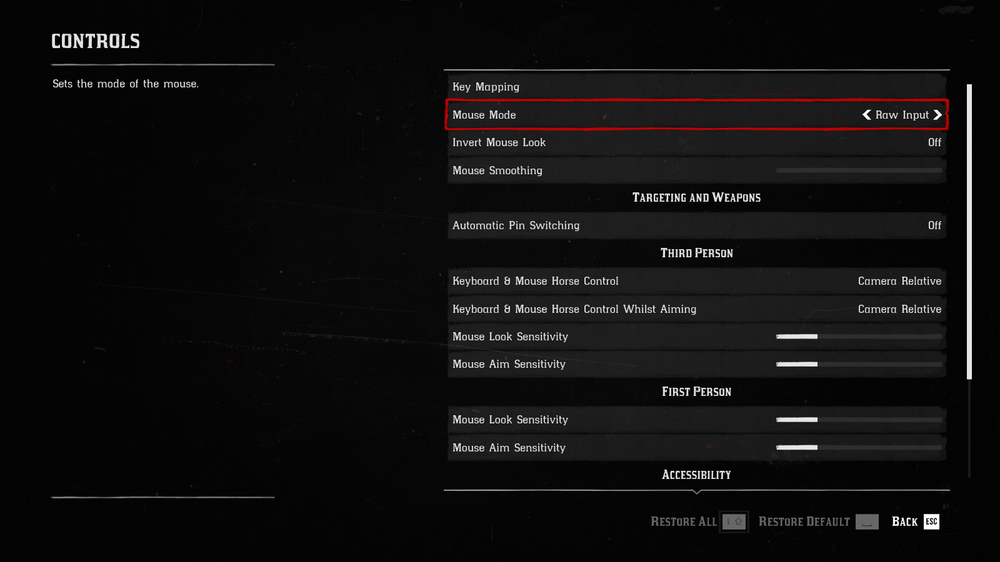

Here are the settings for Red Dead Redemption 2 (RDR2) game. And this environment is only available on Windows.

## RDR2 Setup

### 1. Install RDR2 Dependencies

#### 1.1 To Install Faiss:
```bash
# CPU-only version
conda install -c pytorch faiss-cpu=1.7.4 mkl=2021 blas=1.0=mkl
```

#### 1.2 To Install GroundingDino:

Download its weights to the cache directory:

```bash
mkdir cache
cd cache
curl -L -C - -O https://github.com/IDEA-Research/GroundingDINO/releases/download/v0.1.0-alpha2/groundingdino_swinb_cogcoor.pth
cd ..
```

**Note:**
You should have a CUDA environment, please make sure you have properly installed CUDA dependencies first. You can use the following command to detect it on Linux.
```bash
nvcc -V
```

Or search for its environment variable: CUDA_HOME or CUDA_PATH. On Windows it should be something like "C:\Program Files\NVIDIA GPU Computing Toolkit\CUDA\v11.8" and on Linux like "/usr/local/cuda".

If you don't get the specific version, you should download cudatoolkit and cuDNN first (version 11.8 is recommended).

If you don't download CUDA correctly, after installing GroundingDino, the code will produce:

```bash
NameError: name '_C' is not defined
```

If this happened, please re-setup CUDA and pytorch, reclone the git and perform all installation steps again.

On Windows install from https://developer.nvidia.com/cuda-11-8-0-download-archive (Linux packages also available).

Make sure pytorch is installed using the right CUDA dependencies.

```bash
conda install pytorch torchvision cudatoolkit=11.8 -c nvidia -c pytorch
```

If this doesn't work, or you prefer the pip way, you can try something like:

```bash
pip3 install --upgrade torch==2.1.1+cu118 -f https://download.pytorch.org/whl/torch_stable.html
pip3 install torchvision==0.16.1+cu118 -f https://download.pytorch.org/whl/torch_stable.html
```

Now, you should install the pre-compiled GroundingDino with the project dependencies. You can use the package in our repo and the following commands:

```bash
cd deps
pip install groundingdino-0.1.0-cp310-cp310-win_amd64.whl
cd ..
```

Once it is installed, we need to pre-download some required model files and set some environment variables.

```bash
# Define the necessary environment variables, this can be done in the .env file in the uac directory
HUGGINGFACE_HUB_CACHE = "./cache/hf" # This can be the full path too, if the relative one doesn't work

# Pre-download huggingface files needed by GroundingDino
# This step may require a VPN connection
# Windows user needs to run it in git bash
mkdir $HUGGINGFACE_HUB_CACHE
huggingface-cli download bert-base-uncased config.json tokenizer.json vocab.txt tokenizer_config.json model.safetensors --cache-dir $HUGGINGFACE_HUB_CACHE

# Define the last necessary environment variable, this can be done in the .env file in the uac directory
# This step will avoid needing a VPN to run
TRANSFORMERS_OFFLINE = "TRUE"
```

If for some reason there is some incompatibility in installing or running GroundingDino, it's recommended to recreate your environment.

Only if really necessary, you can try to clone and compile/install GroundingDino yourself.

```bash
# Clone
cd ..
git clone https://github.com/IDEA-Research/GroundingDINO.git
cd GroundingDINO

# Build and install it
pip3 install -r requirements.txt
pip3 install .
cd ../UAC
```

It should install without errors and now it will be available for any project using the same conda environment (uac-dev).

To build the C++ code on Windows, you may need to install build tools.

Download them from https://visualstudio.microsoft.com/visual-cpp-build-tools/
Make sure to select "Desktop Environment with C++" and include the 1st 3 optional packages:
- MSVC v141 or higher
- Windows SDK for your OS version
- CMake tools

#### 1.3 To install the Videosubfinder for Gather Information Module

Download the videosubfinder from https://sourceforge.net/projects/videosubfinder/ and extract the files into the res/tool/subfinder folder.

The file structure should be like this:
- res
  - tool
    - subfinder
      - VideoSubFinderWXW.exe
      - test.srt
      - ...

##### Tunning the videosubfinder
Use res/tool/general.clg to overwrite res/tool/subfinder/settings/general.cfg file.
To get the best extraction results, you can tune the subfinder by changing the parameters in the settings/general.cfg file. You may follow the readme me in Docs folder to get more information about the parameters.
Only modify it if absolutely necessary. Values have already been tuned to game scenario and environment setup.

### 2. Change Settings Before Running the Code

#### 2.1 Mouse Mode
Change mouse mode in the control setting to DirectInput.
| Original interface | Changed interface |
|------------|------------|
|  |  |

#### 2.2 Control
Change both two 'Tap and Hold Speed Control' to on, so we can press w twice to run, saving the need to press shift. Also make sure 'Aiming Mode' to 'Hold To Aim', so we need to keep pressing the mouse right button when aiming.
| Original interface | Changed interface |
|------------|------------|
|  |  |

#### 2.3 Game Screen
The recommended default resolution to use is 1920x1080 (For developers, it must be 1920x1080), but it can vary if the **16:9** aspect ratio is preserved. This means your screen must be of size (1920,1080), (2560,1440) or (3840,2160). DO NOT change the aspect ratio. Also, remember to set the game Screen Type to **Windowed Borderless**.
`SETTING -> GRAPHICS -> Resolution = 1920X1080` and  `Screen Type = Windowed Borderless`


#### 2.4 Mini-map
Remember to enlarge the icon to ensure the program is working well following: `SETTING -> DISPLAY ->  Radar Blip Size = Large` and  `SETTING -> DISPLAY ->  Map Blip Size = Large` and  `SETTING -> DISPLAY ->  Radar = Expanded` (or press Alt + X).


#### 2.5 Subtitles
Enable to show the speaker's name in the subtitles.


### 3. Libraries for Keyboard & Mouse Control

- pyautogui: Used to simulate mouse clicks, including long mouse presses.
- pydirectinput: Used to simulate the operation of the keyboard.
- ahk: Used to simulate mouse swiping, including moveTo and dragTo.
