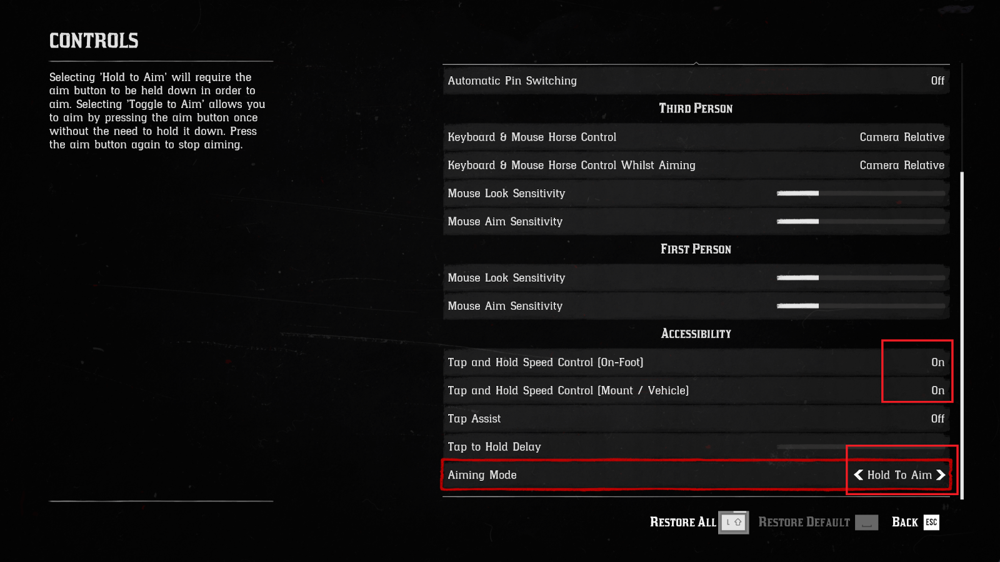
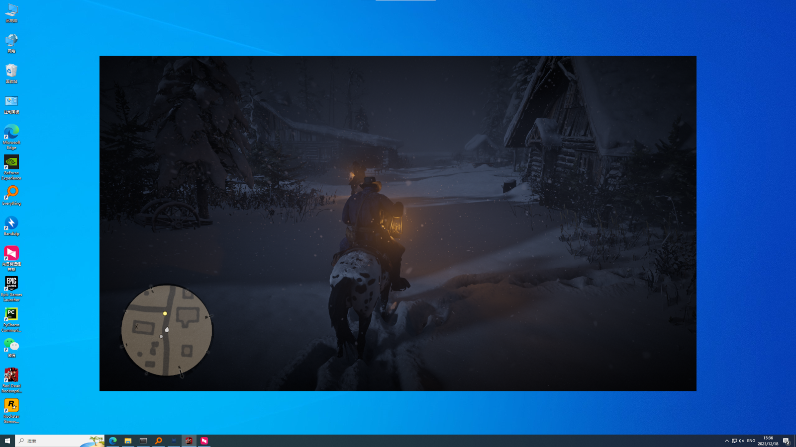
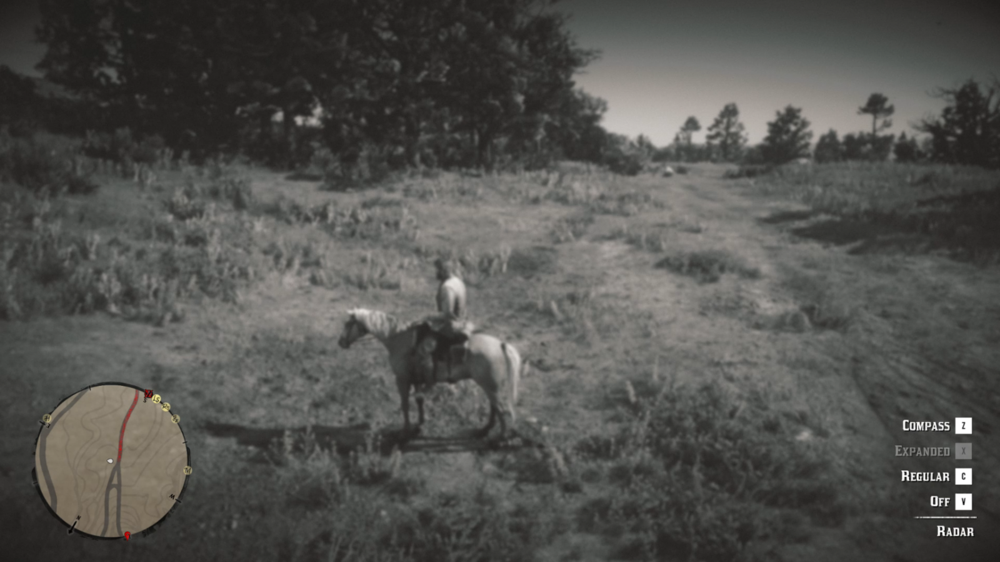
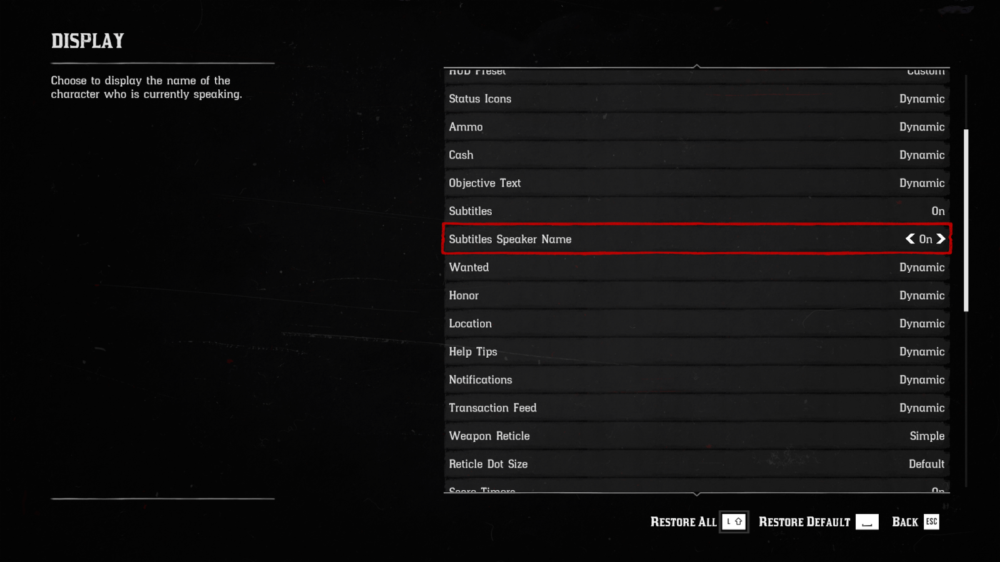

# Red Dead Redemption 2 (RDR2)
Here are the settings for Red Dead Redemption 2 (RDR2) game. And this environment is only available on Windows.

## Setup for RDR2

### Install GroundingDino
```bash
# Install torch and torchvision
pip install --upgrade torch==2.1.1+cu118 -f https://download.pytorch.org/whl/torch_stable.html
pip install torchvision==0.16.1+cu118 -f https://download.pytorch.org/whl/torch_stable.html

# Install the pre-compiled GroundingDino with the project dependencies
# 1. Download the weights to the cache directory
cd cache
curl -L -C - -O https://github.com/IDEA-Research/GroundingDINO/releases/download/v0.1.0-alpha2/groundingdino_swinb_cogcoor.pth
cd ..
# 2. Download the bert-base-uncased model from Hugging Face
mkdir hf
huggingface-cli download bert-base-uncased config.json tokenizer.json vocab.txt tokenizer_config.json model.safetensors --cache-dir hf
# 3. Install the groundingdino
cd ..
git clone https://github.com/IDEA-Research/GroundingDINO.git
cd GroundingDINO
pip install -r requirements.txt
pip install .
cd Cradle
```
If you encounter any issues during the installation of GroundingDINO, please refer to the official website [GroundingDINO](https://github.com/IDEA-Research/GroundingDINO) or our provided [GroundingDino Installation Guide](groundingdino.md).

### Download videosubfinder
Download the videosubfinder from https://sourceforge.net/projects/videosubfinder/ and extract the files into the res/tool/subfinder folder. We have already created the folder for you and included a test.srt, which is a required dummy file that will not affect results.

The file structure should be like this:

```
├── res
  ├── tool
    ├── subfinder
      ├── VideoSubFinderWXW.exe
      ├── test.srt
      ├── ...
```

#### Tunning videosubfinder
Use res/tool/general.clg to overwrite res/tool/subfinder/settings/general.cfg file.
To get the best extraction results, you can tune the subfinder by changing the parameters in the settings/general.cfg file. You may follow the readme me in Docs folder to get more information about the parameters.
Only modify it if absolutely necessary. Values have already been tuned to game scenario and environment setup.

## Change Settings Before Running the Code

### Mouse mode
Change mouse mode in the control setting to DirectInput.
| Original interface | Changed interface |
|------------|------------|
|  |  |

### Control
Change both two 'Tap and Hold Speed Control' to on, so we can press w twice to run, saving the need to press shift. Also make sure 'Aiming Mode' to 'Hold To Aim', so we need to keep pressing the mouse right button when aiming.
| Original interface | Changed interface |
|------------|------------|
|  |  |

### Game screen
The recommended default resolution to use is 1920x1080, but it can vary if the **16:9** aspect ratio is preserved. This means your screen must be of size (1920,1080), (2560,1440) or (3840,2160). DO NOT change the aspect ratio. Also, remember to set the game Screen Type to **Windowed Borderless**.
`SETTING -> GRAPHICS -> Resolution = 1920x1080` and  `Screen Type = Windowed Borderless`



### Mini-map
Remember to enlarge the icon to ensure the program is working well following: `SETTING -> DISPLAY ->  Radar Blip Size = Large` and  `SETTING -> DISPLAY ->  Map Blip Size = Large` and  `SETTING -> DISPLAY ->  Radar = Expanded` (or press Alt + X).




### Subtitles
Enable to show the speaker's name in the subtitles.




## Load Init Environment
For the **main storyline**, you should follow the below steps to initialize the task:
1. Launch the RDR2 game
2. To start from the beginning of Chapter #1, after you lauch the game, pass all introductory videos
3. Pause the game with `esc`


For the open-ended task, we provide a game save in Chapter #2. You can find the save file at `res/rdr2/saves`.

Copy this file to the game save file directory `C:\Users<Your Name>\appdata\Roaming\Goldberg SocialClub Emu Saves\RDR2`

Load the save and pause the game with `esc`


# Run

To simplify operations, the default LLM model we use is OpenAI's `GPT-4o`. Use the follow script to let Cradle play the game.

```bash
# run main storyline
python runner.py --envConfig "./conf/env_config_rdr2_main_storyline.json"
# run open-ended task
python runner.py --envConfig "./conf/env_config_rdr2_open_ended_mission.json"
```