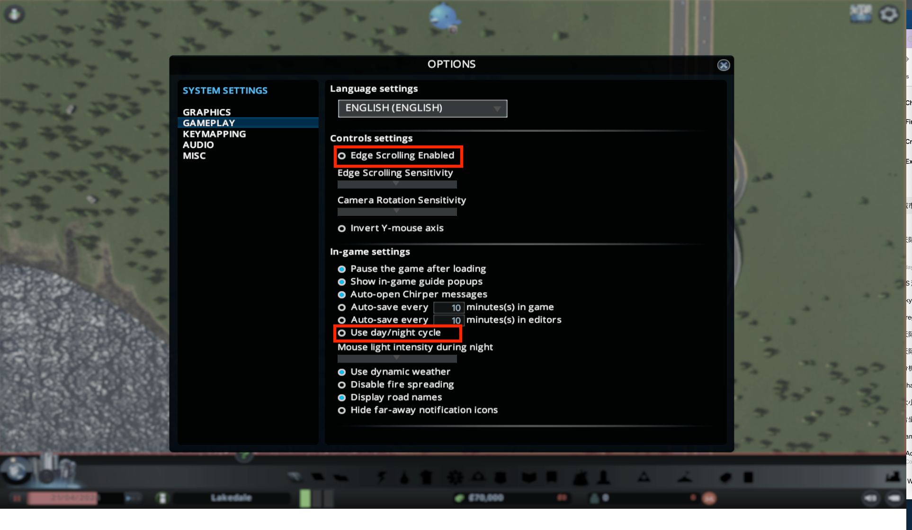
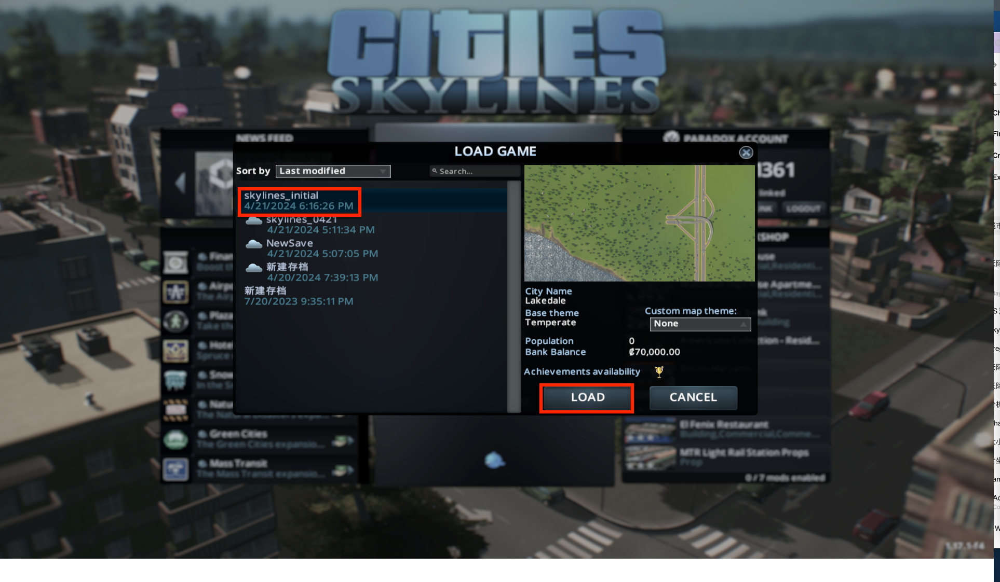

# Cities: Skylines

Here are the settings for Cities: Skylines game.  And this environment is primarily available on MacOS.

### Change Settings Before Running the Code
#### Display settings

- Set the **Aspect Ratio** to 16:9
- Set the **Resolution** to 1920X1080
- Set the **Window Mode** to Fullscreen
If you are using Windows, set your monitor resolution to 1920X1080.  
If you are using MacOS, you need to have an additional monitor and set your external monitor as main screen and set it to 1920X1080.  

#### Gamp play
- Set **Edge Scrolling Enabled** to **Off**
- Set **Use day/night cycle** to **Off**

### Libraries for Keyboard & Mouse Control

- pyautogui: Used to simulate mouse clicks, including long mouse presses. 

### Load Init Environment

We provide a initial environment for you to start with. You can find the initial save file `res/skylines/skylines_initial.crp`.

Copy this file to the game save file directory.

- For Windows: `C:\Users\<username>\AppData\Local\Colossal Order\Cities_Skylines\Saves\skylines_initial.crp`
- For MacOS: `/Users/<username>/Library/Application Support/Colossal Order/Cities_Skylines/Saves/skylines_initial.crp`

### Load the Save File
