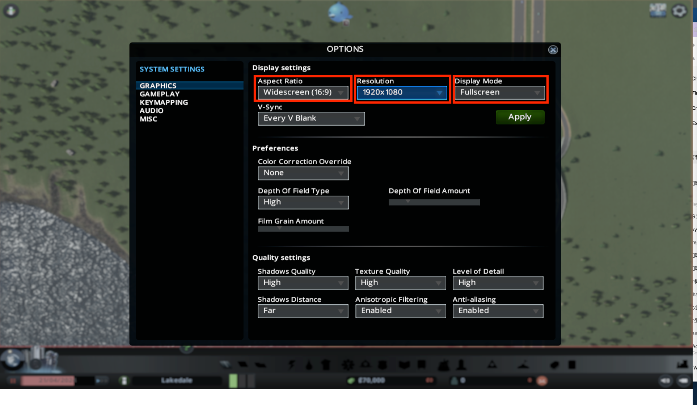
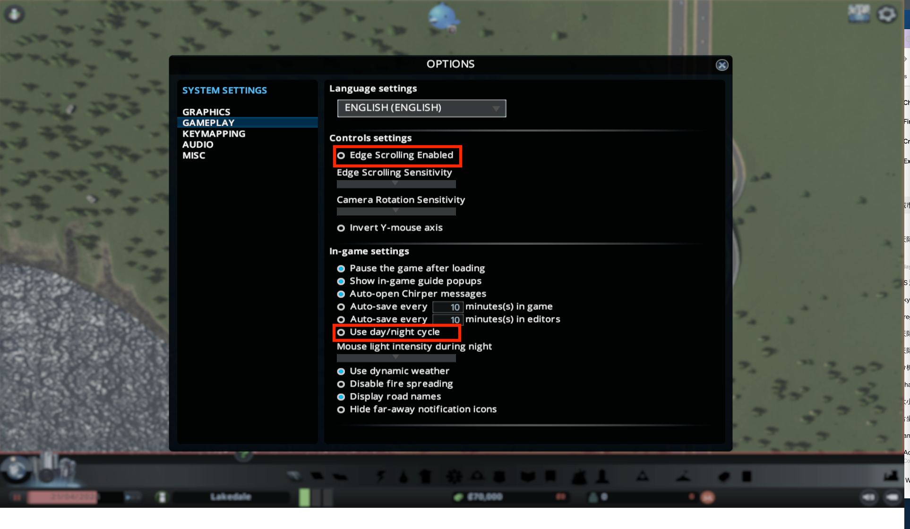
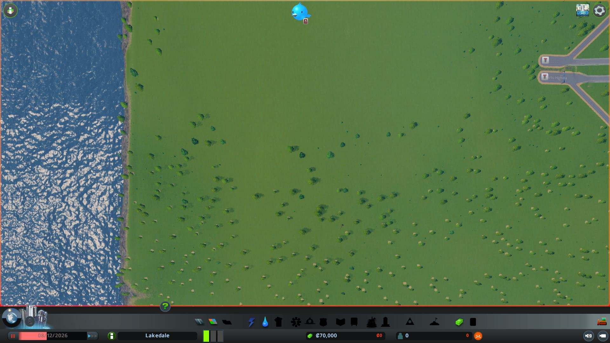

# Cities: Skylines
Here are the settings for Cities: Skylines game. This environment is available on both Windows and MacOS.

## Change Settings Before Running the Code
### Display settings
- Set the **Aspect Ratio** to 16:9
- Set the **Resolution** to 1920x1080
- Set the **Window Mode** to Fullscreen
If you are using Windows, set your monitor resolution to 1920x1080.
If you are using MacOS, you need to have an additional monitor and set your external monitor as main screen and set it to 1920x1080 **low resoultion**, which may need a Mac with a at least M1 chip.
- (Optional) Set Preferences/Color Correction Override to **Vibrant** and Quality settings/Shadows Distance to **Very Short** for better vision.


### Gamp play
- Set **Edge Scrolling Enabled** to **Off**
- Set **Use day/night cycle** to **Off**


## Load Init Environment
We provide a initial environment for you to start with. You can find the initial save file `res/skylines/skylines_initial.crp`.

Copy this file to the game save file directory.

- For Windows: `C:\Users\<username>\AppData\Local\Colossal Order\Cities_Skylines\Saves\skylines_initial.crp`
- For MacOS: `/Users/<username>/Library/Application Support/Colossal Order/Cities_Skylines/Saves/skylines_initial.crp`

Then you will see a game save called skylines_initial. After loading the game save, you will come to the begining of the game.


## Run
To simplify operations, the default LLM model we use is OpenAI's `GPT-4o`. Use the follow script to let Cradle play the game after loading the game save.

```bash
# Run the Cities: Skylines example
python runner.py --envConfig "./conf/env_config_skylines.json"
```