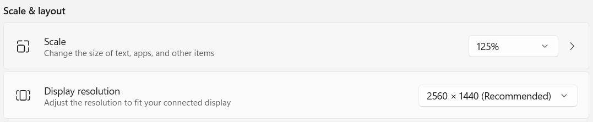
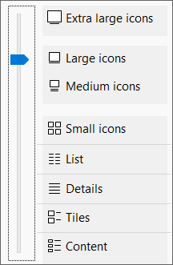
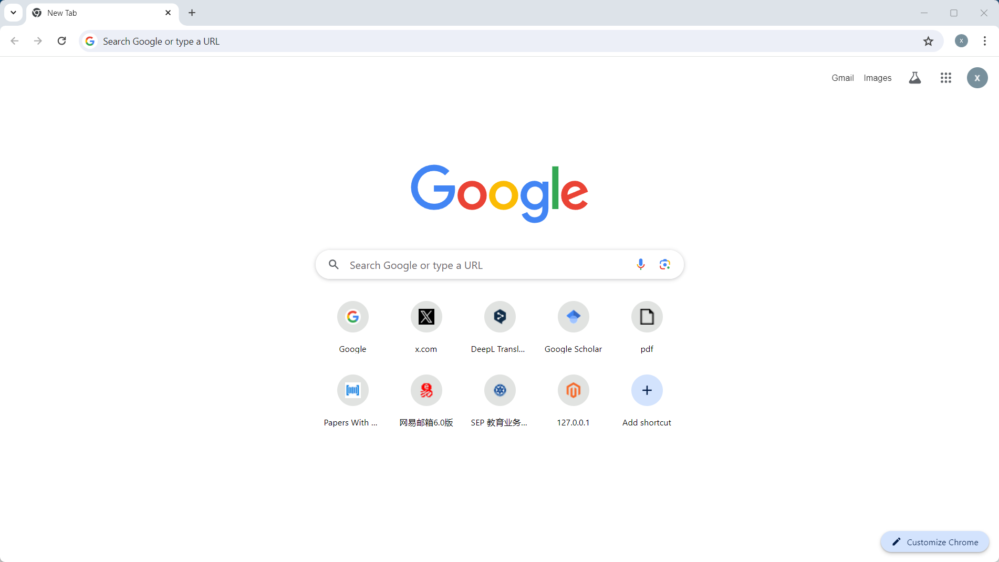
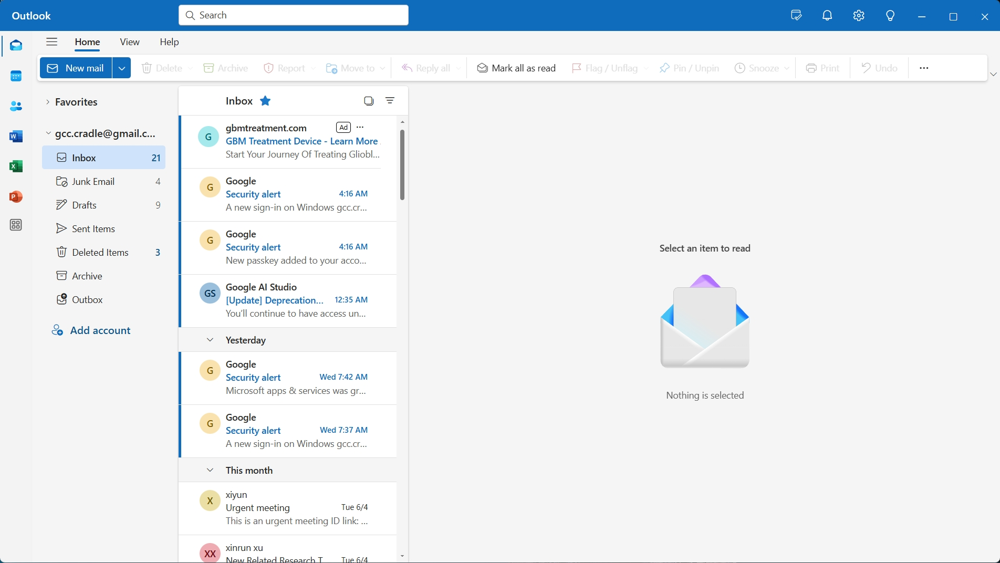
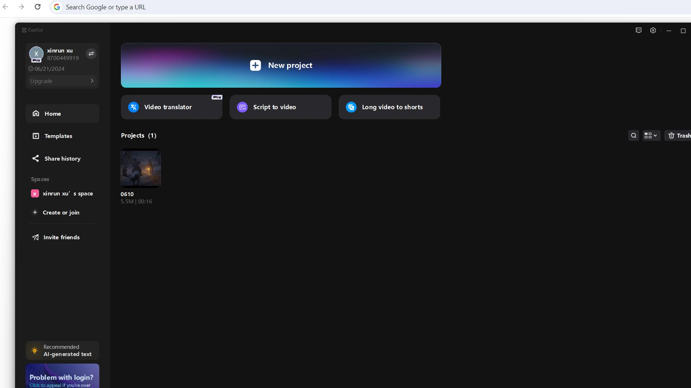
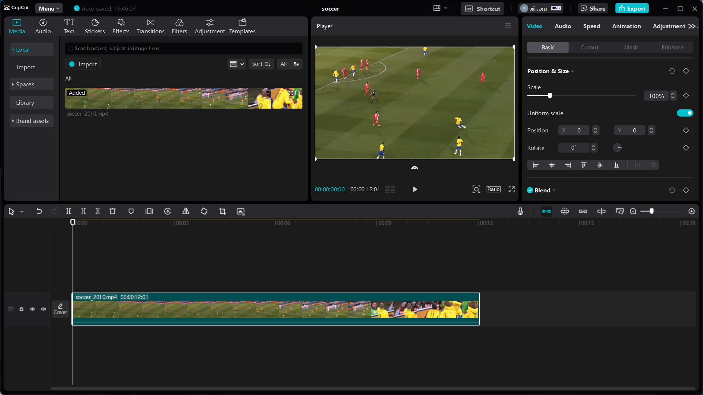
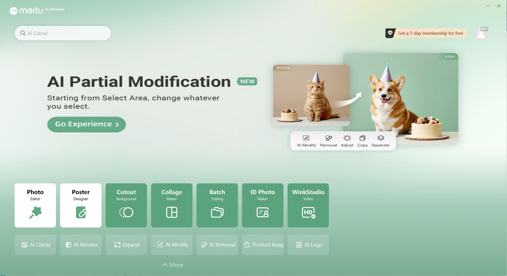
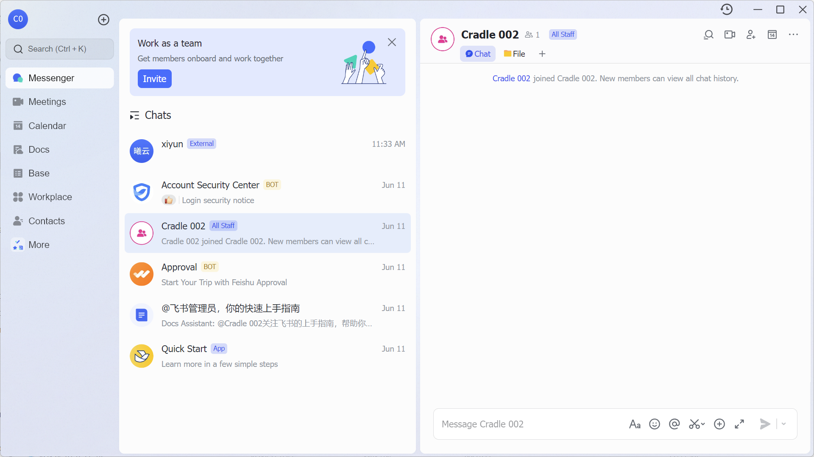

## Software Setup

### 1. Install Software Dependencies

**Install Segment Anything Model (SAM)**

On Windows install from https://developer.nvidia.com/cuda-11-8-0-download-archive (Linux packages also available).

Ensure pytorch is installed using the right CUDA dependencies.

```bash
conda install pytorch torchvision cudatoolkit=11.8 -c nvidia -c pytorch
```

If this doesn't work, or you prefer the pip way, you can try something like:

```bash
pip3 install --upgrade torch==2.1.1+cu118 -f https://download.pytorch.org/whl/torch_stable.html
pip3 install torchvision==0.16.1+cu118 -f https://download.pytorch.org/whl/torch_stable.html
```

Download the [StableSAM](https://huggingface.co/spaces/abhishek/StableSAM/blob/main/sam_vit_h_4b8939.pth) model file and copy it to the `/cache` folder.

### 2. Change Computer Settings Before Running the Code

First, set your main display scale to 125% and ensure your main display resolution is larger than 1920x1080, as shown in the picture below:



Then, set the folder that the agent will open to display in Large icons or Extra large icons format.



### 3. Open the software and task you want to run
Cradle is mainly tested on Chrome, Outlook, Capcut, Meitu and Feishu. Theoretically, it can also be run on other software applications.

#### 3.1 Follow [25 Tasks Provided](#25-tasks-provided) to choose the software and task you want to run
Change the task `task_id` in `cradle/runner/app_runner.py` according to the description in `cradle/conf/env_config_[env_name].json` to switch among tasks.

#### 3.2 Follow [Initial Stage for Each Software](#initial-stage-for-each-software) to open the software 

Below are the exact software versions utilized:

| Software | Version |
| -------- | ------- |
| Chrome   | 125.0.6422.142 |
| Outlook (New)  | 1.2024.529.200 |
| CapCut   | 4.0.0 |
| Meitu    | 7.5.6.1 |
| Feishu   | 7.19.5 |

In theory, any version can be used. However, if you want to reproduce our experimental results, we recommend using the software versions listed below.

### 4. Run

To simplify operations, the default LLM model we use is OpenAI's `GPT-4o`.
After opening the corresponding software on your main screen, use the following script to let Cradle run.

```bash
# Run Chrome
python runner.py --envConfig "./conf/env_config_chrome.json"
# Run Outlook
python runner.py --envConfig "./conf/env_config_outlook.json"
# Run CapCut
python runner.py --envConfig "./conf/env_config_capcut.json"
# Run Meitu
python runner.py --envConfig "./conf/env_config_xiuxiu.json"
# Run Feishu
python runner.py --envConfig "./conf/env_config_feishu.json"
```

## 25 Tasks Provided

Task Descriptions for Chrome, Outlook, CapCut, Meitu and Feishu. **Difficulty** refers to how hard it is for our agent to accomplish the corresponding tasks.

| **Software** | **Description** | **Difficulty** |
|--------------|-----------------|----------------|
| **Chrome**   |                 |                |
| #1 Download Paper| Search for an article with a title like *{paper_title}* and download its PDF file. | Hard |
| #2 Post in Twitter | Post "It's a good day." on my Twitter. | Hard |
| #3 Open Closed Page  | Open the last closed page. | Easy |
| #4 Go to Profile | Find and navigate to *{person_name}*'s homepage on GitHub. | Medium |
| #5 Change Mode | Customize Chrome to dark mode. | Medium |
| **Outlook**  |                 |                |
| #1 Send New E-mail  | Create a new e-mail to *{email_address}* with subject "Hello friend" and send it. | Medium |
| #2 Empty Junk Folder  | Open the junk folder and delete all messages in it, if any. | Medium |
| #3 Reply to Person | Open an e-mail from *{person_name}* in the inbox, reply to it with "Got it. Thanks.", and click send. | Medium |
| #4 Find Target E-mail | Find the e-mail whose subject is "Urgent meeting" and open it. | Easy |
| #5 Setup Forwarding  | Set up email forwarding for every email received to go to *{email_address}*. | Medium |
| **CapCut**   |                 |                |
| #1 Create Media Project| Create a new project, then import *{video_file_name}* to the media, click the "Audio" button to add music to the timeline, and finally export the video. | Hard |
| #2 Add Transition | Open the first existing project. Switch to Transitions panel. Drag a transition effect between the two videos, and then export the video. | Medium |
| #3 Crop by Timestamp  | Delete the video frames after five seconds and then before one second in this video, and then export the video. | Medium |
| #4 Add Sticker  | Open the first existing project. Switch to Stickers panel. Drag a sticker of a person's face to the video, and then export the video. | Hard |
| #5 Crop by Content  | Crop the video when the ball enters the goal, and then export the video. | Very hard |
| **Meitu**    |                 |                |
| #1 Apply Filter | Apply a filter from Meitu to *{picture_file_name}* and save the project. | Easy |
| #2 Cutout  | Cutout a person from *{picture_file_name}* and save the project. | Easy |
| #3 Add Sticker | Add a flower sticker to *{picture_file_name}* and save the picture. | Middle |
| #4 Create Collage | Make a collage using 3 pictures and save the project. | Hard |
| #5 Add Frame | Add a circle-shaped frame to *{picture_file_name}* and save the picture. | Hard |
| **Feishu**   |                 |                |
| #1 Create Appointment| Create a new appointment in my calendar anytime later today with title "Focus time". | Hard |
| #2 Message Contact| Please send a "Hi" chat message to *{contact_name}*. | Easy |
| #3 Send File| Send the AWS bill file at *{pdf_path}* in a chat with *{contact_name}*. | Hard |
| #4 Set User Status| Open the user profile menu and set my status to "In meeting". | Medium |
| #5 Start Video Conference | Create a new meeting and meet now. | Easy |

## Initial Stage for Each Software

### 1. Chrome

When completing each task in Chrome, you need to open the webpage in a new tab and ensure that there is nothing in the search history related to what you are about to search for.



### 2. Outlook

We use the new version of Outlook, and you need to set the following preferences:

Go to Mail > Layout > Focused Inbox and select "Don't sort my messages."
Set Mail > Layout > Text size and spacing to Large.
Set Mail > Layout > Message organization to individual messages.
For each task in Outlook, the initial page is shown in the figure:



- For Task 2, ensure there is at least one email in the junk mail folder.
- For Task 4, ensure there is at least one email in the inbox with the subject "Urgent meeting."

### 3. CapCut

For each task in CapCut, the initial page is shown in the table below:

| CapCut Homepage for task #1, #2, #4 | CapCut Project Page for task #3, #5 |
|------------|------------|
| |  |

- For Task #1, ensure you have a video placed in the default folder that CapCut will open.
- For Task #2, make sure that you have two videos added to the timeline in your first project.
- For Task #3 and Task #4, you need to have one video added to the timeline.
- For Task #5, ensure your task description involves a cropping operation relevant to the video content.

### 4. Meitu

For each task in Meitu, the initial page is shown in the figure:



- For Task #4, ensure you have at least three pictures placed in the default folder that Meitu will open.
- For all other tasks, having one picture in the default folder is sufficient.

### 5. Feishu

For each task in Feishu, the initial page is shown in the figure:



- For Task #3, ensure you have an AWS bill PDF file at your input path.
- For Task #4, set your status to "None" before you begin the test.

## How to Implement Cradle on Other Software

1. Always Pull the Latest Branch:

    - Ensure that you always pull the latest `/main` branch to your current work branch to keep your repository up to date.

2. Configuring the Environment:

    - Add a configuration file in the format `conf\env_config_xxx.json` to adapt Cradle to your target software.

3. Setting Up the Environment:

   - Copy the `cradle\environment\chrome` folder located in `cradle\environment\` and rename it to match your software environment name. Replace all instances of "chrome" within the folder with your software's environment name.
   - Copy the `res\chrome` folder located in `res\` and rename it to your software environment name. Replace all instances of "chrome" within the folder with your software's environment name. Modify the prompts and template-matching icon images as needed for important UI elements that SAM2SOM cannot recognize.
