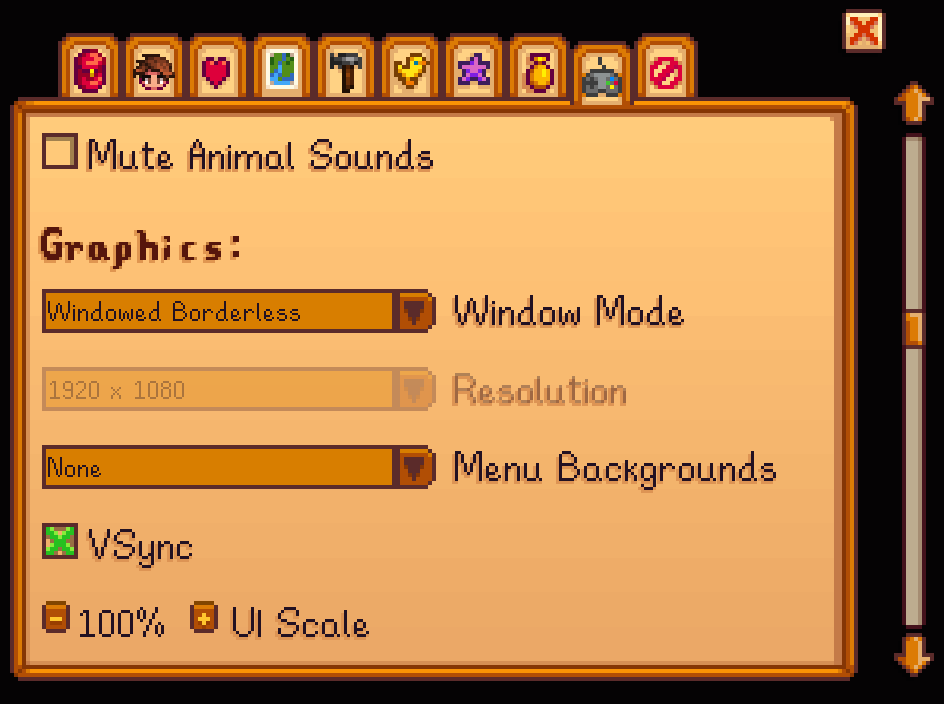

Here are the settings for Stardew Valley game.  And this environment is primarily available on MacOS.

### Change Settings Before Running the Code

#### Resolution
First set Window Mode to Full Screen and then set the resolution to 1920X1080. Then set Window Mode to Windowed and then set it to Windowed Borderless.  
If you are using Windows, set your monitor resolution to 1920X1080.  
If you are using MacOS, you need to have an additional monitor and set your external monitor as main screen and set it to 1920X1080.  

#### Tool hit
Enable "Always Show Tool Hit Location"

### Libraries for Keyboard & Mouse Control

- pyautogui: Used to simulate mouse clicks, including long mouse presses. 

### [Optional] Install Mods for Stardew Valley
Please follow one of the following guideline videos.

[English](https://www.youtube.com/watch?v=CkKq1a1g9jg)  
[Chinese](https://www.bilibili.com/video/BV1XK421x7H9/)

You can download the [Save Anywhere](https://www.nexusmods.com/stardewvalley/mods/8386) mod to save the game at every time and place without going to bed.