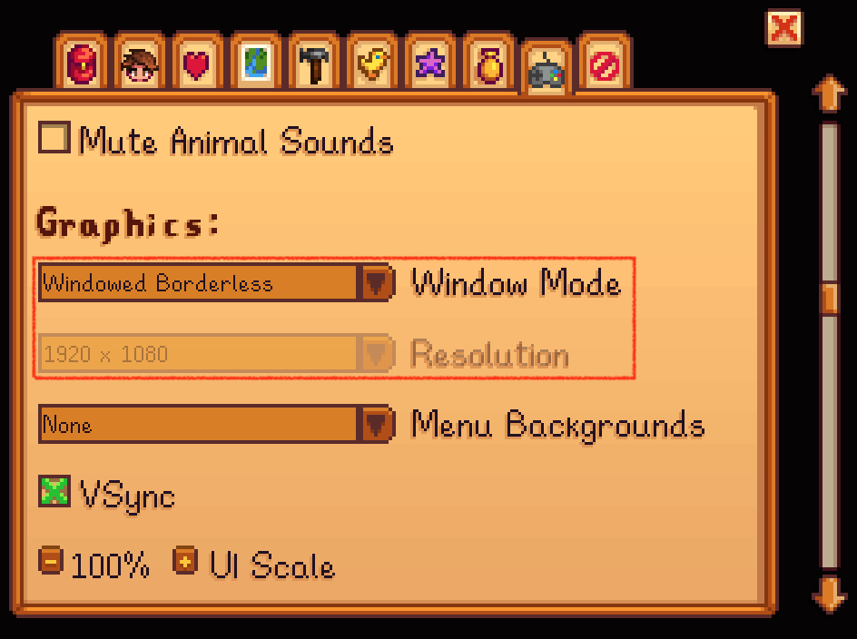

# Stardew Valley
Here are the settings for Stardew Valley game. This environment is available on both Windows and MacOS.

## Change Settings Before Running the Code

#### Resolution
First set **Window Mode** to **Full Screen** and then set the resolution to **1920x1080**. Then set **Window Mode** to **Windowed** and then set it to **Windowed Borderless**.
If you are using Windows, set your monitor resolution to 1920x1080.
If you are using MacOS, you need to have an additional monitor and set your external monitor as main screen and set it to 1920x1080 **low resoultion**, which may need a Mac with a at least M1 chip.


#### Tool hit
1. Enable "Always Show Tool Hit Location"

2. Enable "Lock Toolbar" to lock the toolbar at the bottom of the screen.


### Libraries for Keyboard & Mouse Control

- pyautogui: Used to simulate mouse clicks, including long mouse presses.

### [Optional] Install Mods for Stardew Valley
Please follow one of the following guideline videos.

[English](https://www.youtube.com/watch?v=CkKq1a1g9jg)
[Chinese](https://www.bilibili.com/video/BV1XK421x7H9/)

You can download the [Save Anywhere](https://www.nexusmods.com/stardewvalley/mods/8386) mod to save the game at every time and place without going to bed.

### Load Init Environment

We provide a initial environment for you to start with. You can find the initial save file `res/stardew/Cradle_373947973` for Farm Clearup and `res/stardew/Cradle_372588675` for Cultivation and Go Shopping. You can also create your saves as you wish.

Copy these files to the game save file directory.

- For Windows: `%appdata%\StardewValley\Saves`
- For MacOS: `~/.config/StardewValley/Saves`


Then you will see two saves in game with day 1 (for Farm Clearup) and day 2 (for Cultivation and Go Shopping) seperately. Choose the save and task you want to play.
After loading the game save, you will come to the begining of the game.

<div style="display: flex; justify-content: space-between;">
  <div style="text-align: center; margin-right: 10px;">
    
    <p>Farm Clearup</p>
  </div>
  <div style="text-align: center;">
    
    <p>Cultivation and Go Shopping</p>
  </div>
</div>

### Run
To simplify operations, the default LLM model we use is OpenAI's `GPT-4o`.
After loading the corresponding game save, use the follow script to let Cradle play the game.

```bash
# Run farm clearup
python runner.py --envConfig "./conf/env_config_stardew_farm_clearup.json"
# Run cultivation
python runner.py --envConfig "./conf/env_config_stardew_cultivation.json"
# Run go shopping
python runner.py --envConfig "./conf/env_config_stardew_shopping.json"
```